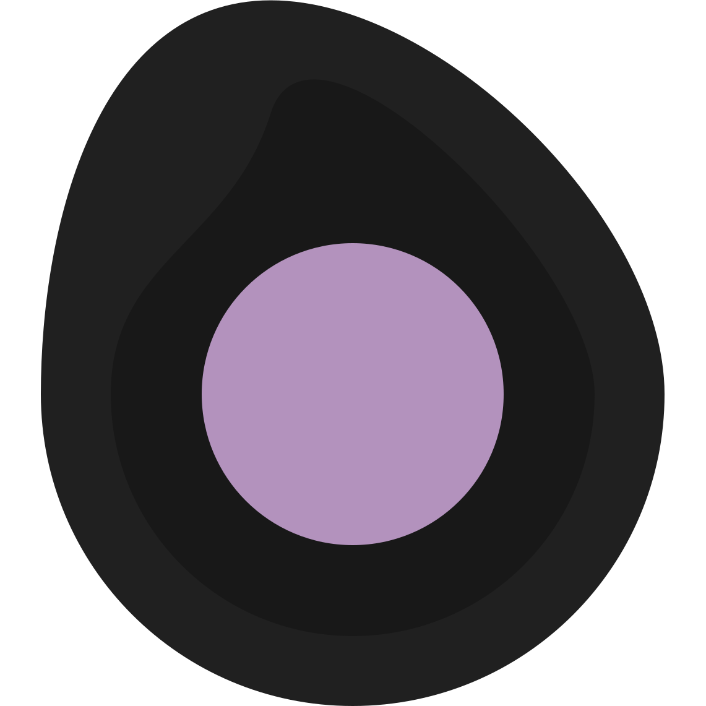

  <table>
    <thead>
      <tr>
        <th align="left" colspan="3" width="800px">
          

            
          

        </th>
      </tr>
    </thead>
    <tbody>
      <tr>
        <td rowspan="2" width="20%" align="center">
          
        </td>
        <td colspan="2">
          <b>
            <h3>
              <a href="https://github.com/chiefmikey/gitlang">GitLang</a>
            </h3>
          </b>
        </td>
      </tr>
      <tr>
        <td width="32%">
          <a href="https://github.com/chiefmikey/gitlang">gitlang.net</a>
        </td>
        <td valign="center">
          View language usage per repo or total by username
        </td>
      </tr>
      <tr>
        <td rowspan="2" width="20%" align="center">
          
        </td>
        <td colspan="2">
          <b>
            <h3>
              <a href="https://github.com/chiefmikey/tomorrow-night-darkly"
                >Tomorrow Night Darkly</a
              >
            </h3>
          </b>
        </td>
      </tr>
      <tr>
        <td width="32%">
          <a href="https://simplydark.net">simplydark.net</a>
        </td>
        <td valign="center">A simply dark theme</td>
      </tr>
      <tr>
        <td rowspan="3" width="20%" align="center">
          
        </td>
        <td colspan="2">
          <b>
            <h3>
              <a href="https://www.npmjs.com/settings/chiefmikey/packages"
                >npm</a
              >
            </h3>
          </b>
        </td>
      </tr>
      <tr>
        <td width="32%">
          <a
            href="https://github.com/chiefmikey/mikey-pro/tree/main/style-guide"
            >mikey-pro</a
          >
        </td>
        <td valign="center">Lint and format code</td>
      </tr>
      <tr>
        <td width="32%">
          <a href="https://github.com/chiefmikey/eslint-plugin-disable-autofix"
            >eslint-plugin-disable-autofix</a
          >
        </td>
        <td valign="center">Disable ESLint autofix for specified rules</td>
      </tr>
    </tbody>
  </table>
  <a href="https://chiefmikey.github.io/CODE_OF_CONDUCT/">CODE OF CONDUCT</a>

