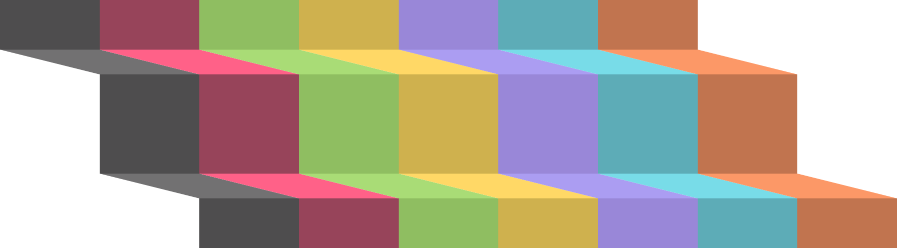

<!DOCTYPE html>

  <table>
    <thead>
      <tr>
        <th align="left" colspan="3" width="800px">
          

            
          

        </th>
      </tr>
    </thead>
    <tbody>
      <tr>
        <td rowspan="3" width="20%" align="center">
          
        </td>
        <td colspan="2">
          <b>
            <h3>Mikey Pro</h3>
          </b>
        </td>
      </tr>
      <tr>
        <td width="32%">
          <a href="https://github.com/mikey-pro/style-guide"> Style Guide </a>
        </td>
        <td valign="center">Lint and format code</td>
      </tr>
      <tr>
        <td valign="center" width="32%">
          <a href="https://github.com/mikey-pro/theme"> Theme </a>
        </td>
        <td valign="center">Look good, feel good</td>
      </tr>
      <tr>
        <td rowspan="2" width="20%" align="center">
          
        </td>
        <td colspan="2">
          <b>
            <h3>npm Packages</h3>
          </b>
        </td>
      </tr>
      <tr>
        <td width="32%">
          <a href="https://github.com/chiefmikey/eslint-plugin-disable-autofix">
            <b>ESLint Plugin</b>
            Disable Autofix
          </a>
        </td>
        <td valign="center">Disable ESLint autofix for specified rules</td>
      </tr>
      <tr>
        <td rowspan="5" width="20%" align="center">
          
        </td>
        <td colspan="2">
          <b>
            <h3>Docker Images</h3>
          </b>
        </td>
      </tr>
      <tr>
        <td width="32%">
          <a
            href="https://github.com/chiefmikey/docker-images/tree/main/alpine-inject"
            target="_blank"
            >Alpine Inject</a
          >
        </td>
        <td valign="center">Externally inject shell commands</td>
      </tr>
      <tr>
        <td width="32%">
          <a
            href="https://github.com/chiefmikey/docker-images/tree/main/alpine-cassandra"
            target="_blank"
            >Alpine Cassandra</a
          >
        </td>
        <td valign="center">Install and initialize Apache Cassandra</td>
      </tr>
      <tr>
        <td width="32%">
          <a
            href="https://github.com/chiefmikey/docker-images/tree/main/alpine-node"
            target="_blank"
            >Alpine Node</a
          >
        </td>
        <td valign="center">A blank slate Node environment</td>
      </tr>
      <tr>
        <td width="32%">
          <a
            href="https://github.com/chiefmikey/docker-images/tree/main/alpine-craftcms"
            target="_blank"
            >Alpine CraftCMS</a
          >
        </td>
        <td valign="center">Install and serve CraftCMS</td>
      </tr>
    </tbody>
  </table>
  
   
  <a href="https://chiefmikey.github.io/CODE_OF_CONDUCT/">CODE OF CONDUCT</a>

